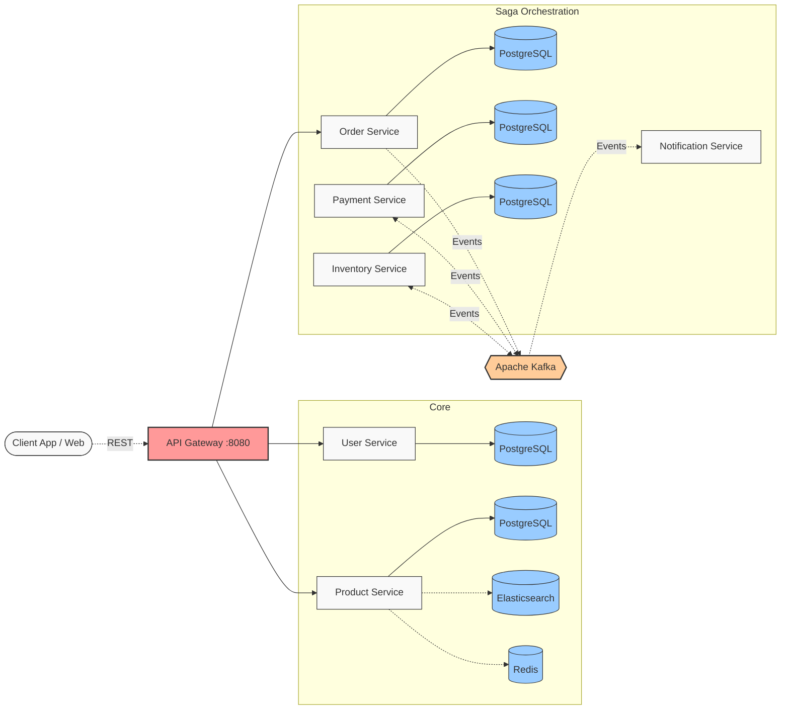
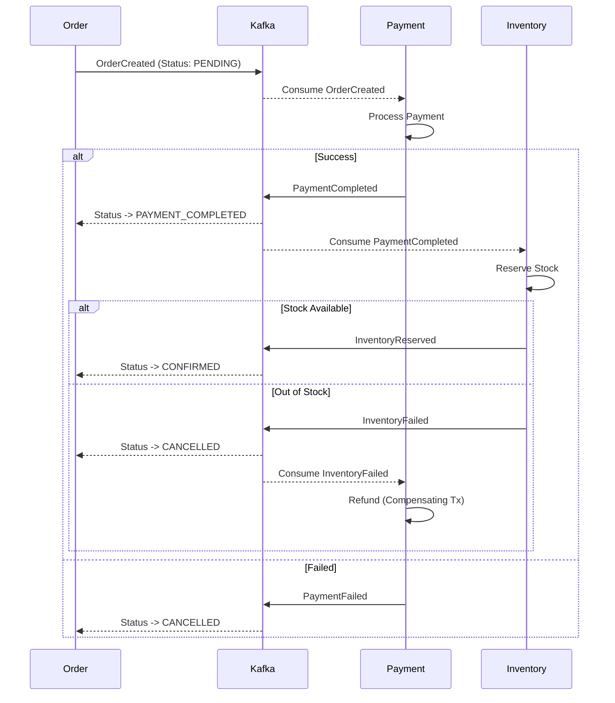

# E-Commerce Microservices Platform

A production-ready e-commerce microservices platform built with Spring Boot 3 and Spring Cloud. This project demonstrates senior-level system design patterns, distributed data management, and resilience engineering.

## Architecture & Services

### High-Level System Architecture



The platform consists of several interconnected microservices, each with a distinct responsibility and isolated database:

*   **API Gateway** (`port: 8080`): Spring Cloud Gateway acting as the single entry point. Handles routing and cross-cutting concerns.
*   **Eureka Server** (`port: 8761`): Service Registry for dynamic service discovery.
*   **Config Server** (`port: 8888`): Centralized configuration management across all environments.
*   **User Service** (`port: 8083`): Manages user accounts (PostgreSQL).
*   **Product Service** (`port: 8084`): Manages catalog. Implements CQRS with PostgreSQL for writes and Elasticsearch for full-text fuzzy search. Uses Redis for cache-aside read optimization.
*   **Order Service** (`port: 8085`): Manages order lifecycle. Acts as the entry point for the Saga orchestration.
*   **Payment Service** (`port: 8088`): Processes payments idempotently.
*   **Inventory Service** (`port: 8087`): Manages stock reservations using optimistic locking to prevent overselling.
*   **Notification Service** (`port: 8089`): Consumes events to notify users of order status.

## Key Design Patterns & Technical Highlights

### 1. Saga Orchestration (Distributed Transactions)



Implemented a choreography-based Saga to maintain data consistency across `order-service`, `payment-service`, and `inventory-service` without distributed locks (2PC).
*   **Messaging**: Apache Kafka (`acks=all`, `enable.idempotence=true`).
*   **Compensating Transactions**: Automatic refunds are issued if inventory reservation fails after payment succeeds.
*   **Event-Driven**: Services react to domain events (`OrderCreatedEvent`, `PaymentCompletedEvent`, `InventoryReservedEvent`, etc.) mapped via Kafka `TYPE_MAPPINGS`.

### 2. CQRS & Cache-Aside (Performance & Search)
The `product-service` splits read and write operations to optimize for different workloads:
*   **Write Model**: PostgreSQL (ACID compliance).
*   **Read Model**: Elasticsearch (fuzzy `multi_match` queries for fast catalog search). Synced near-real-time on writes.
*   **Caching**: Redis (Lettuce client) handles high-throughput point reads (get-by-id) with automatic cache invalidation (`@CacheEvict`) and pre-population (`@CachePut`).

### 3. Resilience & Fault Tolerance
*   **Circuit Breaker**: Resilience4j protects inter-service synchronous calls (e.g., Order -> Product via OpenFeign) from cascading failures.
*   **Optimistic Locking**: JPA `@Version` in `inventory-service` handles concurrent checkout attempts safely.
*   **Idempotency**: Kafka consumers (e.g., payment processing) use unique transaction IDs derived from order IDs to safely handle at-least-once delivery retries.

### 4. Observability
*   **Distributed Tracing**: Micrometer Tracing + Zipkin Brave correlates logs across service boundaries using `traceId` and `spanId`.
*   **Centralized Logging**: Consistent structured logging across all services.

## Tech Stack

*   **Java 21**
*   **Spring Boot 3.2.x**
*   **Spring Cloud** (2023.0.x)
*   **Databases**: PostgreSQL (Relational), Elasticsearch 8.x (Search), Redis 7.x (Cache)
*   **Messaging**: Apache Kafka
*   **Observability**: Micrometer, Zipkin
*   **Build**: Maven

## Local Development Setup

### Prerequisites
*   Java 21
*   Maven
*   Docker & Docker Compose (or standalone Docker)

### 1. Start Infrastructure
Start the required databases and message broker using Docker:

```bash
# 1. PostgreSQL (default port 5432)
# 2. Apache Kafka & Zookeeper (default ports 9092, 2181)
# 3. Zipkin (default port 9411)

# 4. Elasticsearch (Security disabled for local dev)
docker run -d --name elasticsearch -p 9200:9200 -p 9300:9300 -e "discovery.type=single-node" -e "xpack.security.enabled=false" -e "ES_JAVA_OPTS=-Xms512m -Xmx512m" elasticsearch:8.11.0

# 5. Redis
docker run -d --name redis -p 6379:6379 redis:7.2-alpine
```

### 2. Start Services
Services must be started in a specific order due to dependencies:

1.  **Config Server** (`config-server`)
2.  **Eureka Server** (`eureka-server`)
3.  **Core Services** (Start in any order: `product-service`, `user-service`, `payment-service`, `inventory-service`, `notification-service`)
4.  **Order Service** (`order-service` - requires other services to be up for Feign clients)
5.  **API Gateway** (`api-gateway`)

You can run each service using Maven:
```bash
cd <service-folder>
mvn spring-boot:run
```

## API Access
All requests should be routed through the API Gateway on `http://localhost:8080`.
Example:
*   `GET http://localhost:8080/products`
*   `POST http://localhost:8080/orders`
